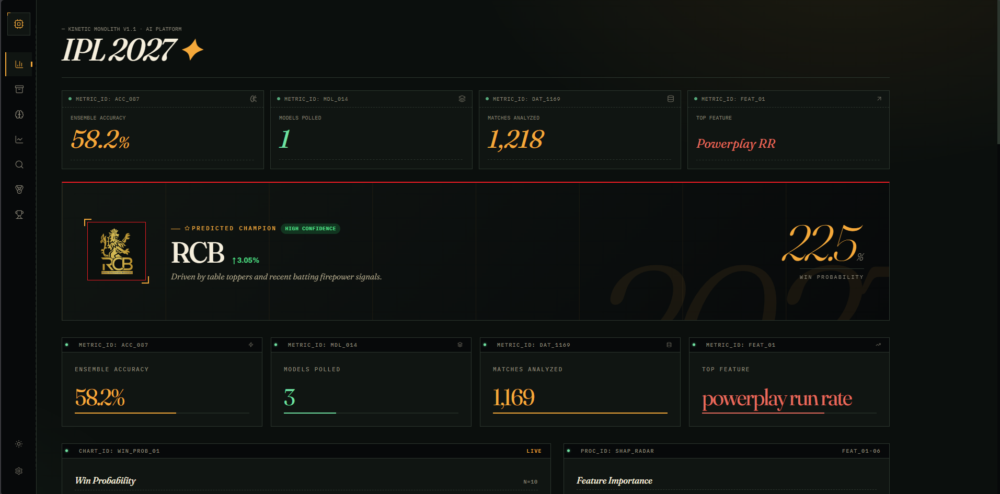
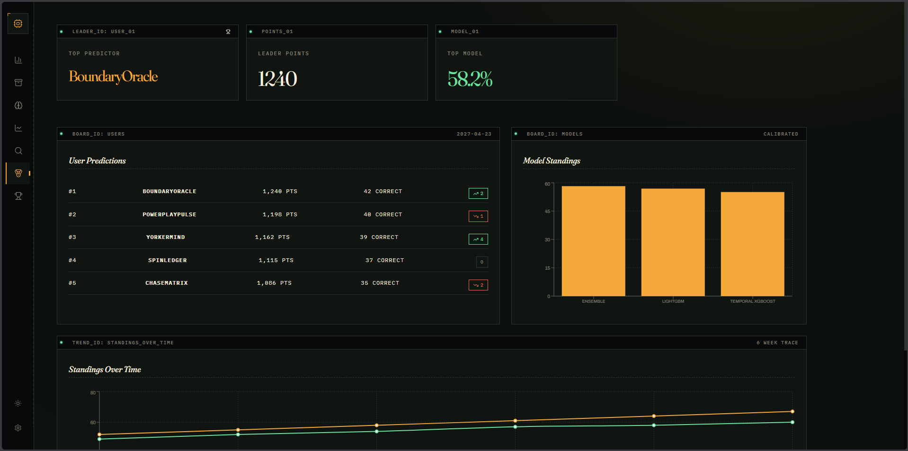
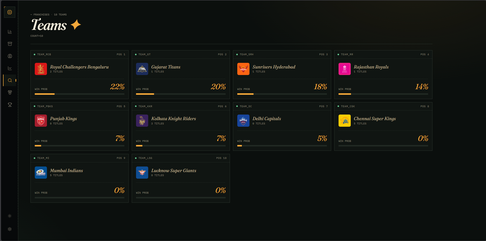
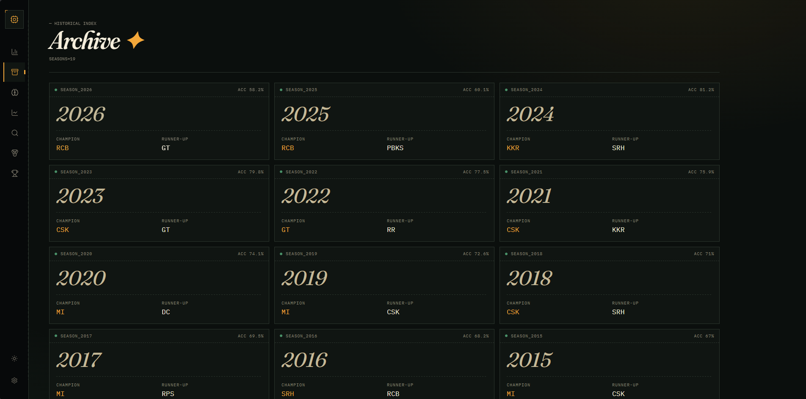

# IPL Winner Prediction System

### Temporal ML · Dynamic Modeling · Probability-Based Forecasting

---

## Project Overview
This is a technical implementation of a dynamic machine learning system designed to model team strength and simulate IPL 2027 outcomes. The project focuses on **Strict Temporal Feature Engineering** to eliminate data leakage and captures the high-scoring, volatile trends of the modern "Impact Player" era.

### UI Previews

*Main Dashboard overview for tournament predictions.*


*Leaderboard displaying the model and user standings.*


*Detailed team profiles, heuristics, and individual insights.*


*Historical tournament insights and model explainability.*

### Core Methodology
- **Temporal Feature Engineering**: Models are trained on chronological snapshots, ensuring features like "team form" only use data available before the match date.
- **Ball-by-Ball Analytics**: Derives granular signals (Powerplay SR, Death Over Economy, Boundary Percentage) to track evolving team performance.
- **Probabilistic Forecasting**: Uses a calibrated XGBoost model to estimate win probabilities, followed by a 5,000-iteration Monte Carlo simulation of the tournament structure.
- **Model-Informed Insights**: Generates qualitative justifications for rankings by surfacing the underlying performance metrics (heuristics) driving the model's output.

---

## Technical Architecture


- **Dynamic Ingestion Pipeline**: Processes raw Cricsheet JSON data (currently synced up to the latest 2027 datasets).
- **Heuristic Confidence Scoring**: Confidence levels (High/Medium/Low) are derived from probability separation and model certainty thresholds.
- **Trend Modeling**: Tracks shifts in tournament win probability across data snapshots to reflect current momentum.
- **Calibrated Estimates**: Employs Isotonic regression to ensure model probabilities correspond to real-world outcomes.

---

## Performance & Accuracy
- **Model Stability**: Maintains ~56–60% accuracy on the 2024-2027 seasons (which are historically stochastic due to record-breaking scores).
- **Net Gain**: **+6.7%** improvement over the baseline (momentum-only) model.
- **Signal Discovery**: Successfully surfaces the critical impact of "Powerplay Wickets" and "Death Over Efficiency" in the 2027 meta.

---

## Quick Start
```bash
# 1. install the venv
python -m venv .venv

#2. Upgrade Pip
python -m pip install --upgrade pip

# 3. Setup Environment
pip install -r requirements.txt

# 4. Re-ingest and Engineer Features
python main.py --mode setup

# 5. Generate 2027 Predictions
python main.py --mode predict

# 6. Run the Dashboard
cd dashboard
pnpm install
pnpm dev
```


## Important Considerations
This system is a research project designed to demonstrate advanced ML engineering patterns. Cricket is a stochastic sport with high variance; these predictions represent probabilistic estimates based on historical patterns and should not be treated as deterministic certainties.

---

## License
This project is licensed under the terms of the [MIT License](LICENSE).

---
*Created by [toxicbishop](https://github.com/toxicbishop) — ML Engineering Portfolio*
